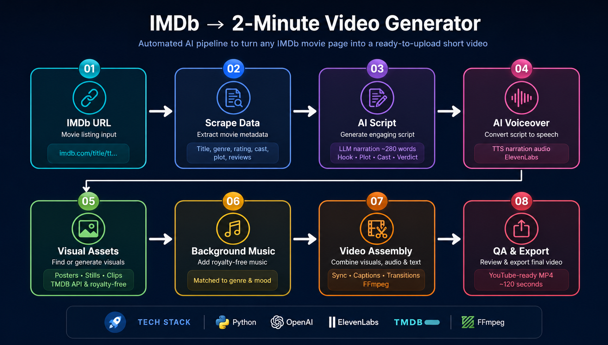

# imdb-to-video

AI-powered pipeline that converts any IMDb movie page into a ready-to-upload ~2-minute short video.



---

## Pipeline

```
IMDb URL
  │
  ▼
┌──────────────────────┐
│  1. Scrape metadata  │  requests + BeautifulSoup → JSON-LD schema.org/Movie
└──────────┬───────────┘
           │ MovieData
  ┌────────┴────────┐
  ▼                 ▼
┌──────────┐  ┌──────────────────────────────────────┐
│ 2. Audio  │  │  3. Render frames  (24 fps JPEG)      │
│           │  │                                      │
│ espeak-ng │  │  ① Title card          4 s           │
│ + FFmpeg  │  │  ② Film details        5 s           │
│ warmth EQ │  │  ③ Cast showcase       5 s           │
└─────┬─────┘  │  ④ Plot synopsis     ~40 s           │
      │        │  ⑤ Why watch?         30 s           │
      │        │  ⑥ Quote / legacy     10 s           │
      │        │  ⑦ Outro               6 s           │
      │        └──────────────┬───────────────────────┘
      └───────────┬───────────┘
                  ▼
        ┌──────────────────┐
        │  4. FFmpeg mux   │  H.264 + AAC → MP4  (~100 s)
        └──────────────────┘
```

---

## Quick start

```bash
# 1. System dependencies
sudo apt-get install -y ffmpeg espeak-ng

# 2. Install Python package
pip install -e ".[dev]"

# 3. Run
python -m imdb_pipeline https://www.imdb.com/title/tt0111161/
# → outputs/movie_spotlight.mp4
```

---

## Usage

```bash
# Any IMDb title URL
python -m imdb_pipeline https://www.imdb.com/title/tt0111161/

# Custom output path
python -m imdb_pipeline https://www.imdb.com/title/tt0068646/ ./godfather.mp4

# Verbose logging
python -m imdb_pipeline https://www.imdb.com/title/tt0111161/ --verbose

# Python API
from imdb_pipeline.pipeline import run
output = run("https://www.imdb.com/title/tt0111161/")
```

---

## Project layout

```
imdb_pipeline/
├── config.py           All tuneable constants (resolution, FPS, colours …)
├── models.py           MovieData dataclass — shared across all stages
├── pipeline.py         Orchestrator: scrape → audio → render → assemble
│
├── scraper/
│   ├── imdb.py         Live IMDb scraper (JSON-LD + HTML fallback)
│   └── demo.py         Bundled offline demo movies
│
├── audio/
│   └── tts.py          espeak-ng narration + FFmpeg warmth filter
│
├── renderer/
│   ├── primitives.py   Drawing helpers: gradients, pills, star ratings …
│   ├── sections.py     One function per slide section
│   └── pipeline.py     Sequences sections, returns total frame count
│
└── assembler/
    └── ffmpeg.py       FFmpeg mux: JPEG frames + audio → MP4

__main__.py             CLI  (python -m imdb_pipeline …)
tests/                  32 pytest tests
pyproject.toml          Build config + dependencies
```

---

## Configuration

All constants live in `imdb_pipeline/config.py` — change them there without touching any business logic:

```python
FPS              = 24
VIDEO_WIDTH      = 1280
VIDEO_HEIGHT     = 720
FFMPEG_CRF       = 20       # H.264 quality (lower = better)
TTS_SPEED        = 140      # words per minute
SECTION_DURATIONS = {"title": 4, "stats": 5, ...}
```

---

## Tests

```bash
pytest -v
pytest --cov=imdb_pipeline --cov-report=term-missing
```

---

## Requirements

| Dependency     | Purpose                        |
|----------------|--------------------------------|
| Python ≥ 3.10  |                                |
| ffmpeg         | Frame muxing, audio conversion |
| espeak-ng      | Offline TTS narration          |
| requests       | IMDb HTTP scraping             |
| beautifulsoup4 | HTML parsing                   |
| Pillow         | Frame rendering                |
| numpy          | Vignette / grain effects       |

---

## Author

Muheet Mehraj
